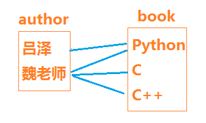

# 《Django 教程》
 - 讲师: 魏明择
 - 时间: 2019

## 目录
<!-- TOC depthFrom:3 depthTo:5 -->


<!-- /TOC -->

#### 聚合查询
- 聚合查询是指对一个数据表中的一个字段的数据进行部分或全部进行统计查询,查bookstore_book数据表中的全部书的平均价格，查询所有书的总个数等,都要使用聚合查询
1. 不带分组聚合
    - 不带分组的聚合查询是指导将全部数据进行集中统计查询
    - 聚合函数:
        - 定义模块: `django.db.models`
        - 用法: `from django.db.models import *`
        - 聚合函数: 
            - Sum, Avg, Count, Max, Min
    - 语法: 
        - MyModel.objects.aggregate(结果变量名=聚合函数('列'))
    - 返回结果:
        - 由 结果变量名和值组成的字典
        - 格式为:
            - `{"结果变量名": 值}
    - 示例:
        ```
        # 得到所有书的平均价格
        from bookstore import models
        from django.db.models import Count
        result = models.Book.objects.aggregate(myAvg=Avg('price'))
        print("平均价格是:", result['myAvg'])
        print("result=", result)  # {"myAvg": 58.2}
        
        # 得到数据表里有多少本书
        from django.db.models import Count
        result = models.Book.objects.aggregate(mycnt=Count('title'))
        print("数据记录总个数是:", result['mycnt'])
        print("result=", result)  # {"mycnt": 10}

        ```
2. 分组聚合
    - 分组聚合是指通过计算查询结果中每一个对象所关联的对象集合，从而得出总计值(也可以是平均值或总和)，即为查询集的每一项生成聚合。

    - 语法: 
        - QuerySet.annotate(结果变量名=聚合函数('列'))
    - 用法步骤:
        1. 通过先用查询结果MyModel.objects.value. 查找查询要分组聚合的列
            - MyModel.objects.value('列1', '列2')
            - 如: 
                ```py
                pub_set = models.Book.objects.values('pub')
                print(books)  # <QuerySet [{'pub': '清华大学出版社'}, {'pub': '清华大学出版社'}, {'pub_hou {'pub': '机械工业出版社'}, {'pub': '清华大学出版社'}]>

                ```
        2. 通过返回结果的 QuerySet.annotate 方法分组聚合得到分组结果
            - QuerySet.annotate(名=聚合函数('列'))
            - 返回 QuerySet 结果集,内部存储结果的字典
            - 如:
                ```
                pub_count_set = pub_set.annotate(myCount=Count('pub'))
                print(pub_count_set)  # <QuerySet [{'pub': '清华大学出版社', 'myCount': 7}, {'pub': '机械工业出版社', 'myCount': 3}]>
                ```
            
        - .values('查询列名')
    - 示例:
        - 得到哪儿个出版社共出版多少本书
        ```py
        def test_annotate(request):
           - from django.db.models import Count
            from . import models

            # 得到所有出版社的查询集合QuerySet
            pub_set = models.Book.objects.values('pub')
            # 根据出版社查询分组，出版社和Count的分组聚合查询集合
            pub_count_set = pub_set.annotate(myCount=Count('pub'))  # 返回查询集合
            for item in pub_count_set:
                print("出版社:", item['pub'], "图书有：", item['myCount'])
            return HttpResponse('请查看服务器端控制台获取结果')
        ```

#### F对象
- 一个F对象代表数据库中某个字段的信息
- F对象通常是对数据库中的字段值在不加载到内存中的情况下直接在数据库服务器端进行操作
- F对象在 数据包 django.db.models 中.使用时需要通过如下语句进行加载
    - `from django.db.models import F`
1. 作用:
    - 用于类属性(字段)之间的比较。
    - 当同时对数据库中两个字段的值进行比较获取 QuerySet 数据集时，可以便用F对象
2. 说明:
    - 一个 F() 对象代表了一个model的字段的值
3.  使用它就可以直接参考model的field和执行数据库操作而不用再把它们（model field）查询出来放到python内存中。

4. 语法:
    ```
    from django.db.models import F
    F('列名')
    ```

5. 示例1
    - 更新Book实例中所有的零售价涨10元
    ```
    models.Book.objects.all().update(market_price=F('market_price')+10)
    # 以下做法好于如下代码
    books = models.Book.objects.all()
    for book in books:
        book.update(market_price=book.marget_price+10)
        book.save()
    ```
6. 示例2
    - 对数据库中两个字段的值进行比较，列出哪儿些书的零售价高于定价?
    ```py
    from django.db.models import F
    from bookstore import models
    books = models.Book.objects.filter(market_price__gt=F('price'))
    for book in books:
        print(book.title, '定价:', book.price, '现价:', book.market_price)
    ```

#### Q对象 - Q()
- 当在获取查询结果集 使用复杂的逻辑或  `|` 、 逻辑非 `~` 等操作时可以借助于 Q对象进行操作
- 如: 想找出定价低于20元 或 清华大学出版社的全部书，可以写成
    ```
    models.Book.objects.filter(Q(price__lt=20)|Q(pub="清华大学出版社"))
    ```
- Q对象在 数据包 django.db.models 中。需要先导入再使用
    - `from django.db.models import Q`

1. 作用
    - 在条件中用来实现除 and(&) 以外的 or(|) 或 not(~) 操作
2. 运算符:
    - & 与操作
    - | 或操作
    - 〜 非操作
2. 语法
    ```
    from django.db.models import Q
    Q(条件1)|Q(条件2)  # 条件1成立或条件2成立
    Q(条件1)&Q(条件2)  # 条件1和条件2同时成立
    Q(条件1)&~Q(条件2)  # 条件1成立且条件2不成立
    ...
    ```
3. 示例
    ```py
    from django.db.models import Q
    # 查找清华大学出版社的书或价格低于50的书
    models.Book.objects.filter(Q(market_price__lt=50) | Q(pub_house='清华大学出版社'))
    # 查找不是机械工业出版社的书且价格低于50的书
    models.Book.objects.filter(Q(market_price__lt=50) & ~Q(pub_house='机械工业出版社'))
    ```

#### 原生的数据库操作方法
##### 使用MyModel.objects.raw()进行 数据库查询操作查询
- 在django中，可以使用模型管理器的raw方法来执行select语句进行数据查询
1. 语法: 
    - `MyModel.objects.raw(sql语句)`
2. 用法
    - `MyModel.objects.raw('sql语句')`
3. 返回值:
    - QuerySet 集合对象
4. 示例
    ```py
    books = models.Book.objects.raw('select * from bookstore_book')

    for book in books:
        print(book)
    ```

##### 使用django中的游标cursor对数据库进行 增删改操作
- 在Django中可以使用 如UPDATE,DELETE等SQL语句对数据库进行操作。
- 在DJaogo中使用上述非查询语句必须使用游标进行操作
- 使用步骤:
   1. 导入cursor所在的包
        - Django中的游标cursor定义在 django.db.connection包中，使用前需要先导入
        - 如：
            - `from django.db import connection`
    2. 用创建cursor类的构造函数创建cursor对象，再使用cursor对象,为保证在出现异常时能释放cursor资源,通常使用with语句进行创建操作
        - 如:
            ```py
            from django.db import connection
            with connection.cursor() as cur:
                cur.execute('执行SQL语句')
            ```

    - 示例
        ```py
        # 用SQL语句将id 为 10的 书的出版社改为 "XXX出版社"
        from django.db import connection
        with connection.cursor() as cur: 
            cur.execute('update bookstore_book set pub_house="XXX出版社" where id=10;')

        with connection.cursor() as cur:
            # 删除 id为1的一条记录
            cur.execute('delete from bookstore_book where id=10;')
        ```


### admin 后台数据库管理
- django 提供了比较完善的后台管理数据库的接口，可供开发过程中调用和测试使用
- django 会搜集所有已注册的模型类，为这些模型类提拱数据管理界面，供开发者使用
- 使用步骤:
    1. 创建后台管理帐号:
        - 后台管理--创建管理员帐号
            - `$ python3 manage.py createsuperuser`            
            - 根据提示完成注册,参考如下:
            ```shell
            $ python3 manage.py createsuperuser
            Username (leave blank to use 'tarena'): tarena  # 此处输入用户名
            Email address: weimz@tedu.cn  # 此处输入邮箱
            Password: # 此处输入密码(密码要复杂些，否则会提示密码太简单)
            Password (again): # 再次输入重复密码
            Superuser created successfully.
            $ 
            ```
    2. 用注册的帐号登陆后台管理界面
        - 后台管理的登录地址:
            - <http://127.0.0.1:8000/admin>

#### 自定义后台管理数据表
- 若要自己定义的模型类也能在 `/admin` 后台管理界中显示和管理，需要将自己的类注册到后台管理界面
- 添加自己定义模型类的后台管理数据表的,需要用`admin.site.register(自定义模型类)` 方法进行注册
    - 配置步骤如下:
        1. 在应用app中的admin.py中导入注册要管理的模型models类, 如:
            ```
            from . import models
            ```
        2. 调用 admin.site.register 方法进行注册,如:
            ```
            from django.contrib import admin
            admin.site.register(自定义模型类)
            ```
    - 如: 在 bookstore/admin.py 添加如下代码对Book类进行管理
    - 示例:
        ```py
        # file: bookstore/admin.py
        from django.contrib import admin
        # Register your models here.

        from . import models
        ...
        admin.site.register(models.Book)  # 将Book类注册为可管理页面
        ```

#### 修改后台Models的展现形式
- 在admin后台管理数据库中对自定义的数据记录都展示为 `XXXX object` 类型的记录，不便于阅读和判断
- 在用户自定义的模型类中可以重写 `def __str__(self):` 方法解决显示问题,如:
    - 在 自定义模型类中重写 __str__(self) 方法返回显示文字内容:
    ```py
    class Book(models.Model):
        ...
        def __str__(self):
            return "书名" + self.title
    ```

#### 模型管理器类
- 作用:
    - 为后台管理界面添加便于操作的新功能。
- 说明:
    - 后台管理器类须继承自 `django.contrib.admin` 里的 `ModelAdmin` 类
- 模型管理器的使用方法:
    1. 在 `<应用app>/admin.py` 里定义模型管理器类
        ```
        class XXXX_Manager(admin.ModelAdmin):
            ......
        ```
    2. 注册管理器与模型类关联
        ```
        from django.contrib import admin
        from . import models
        admin.site.register(models.YYYY, XXXX_Manager) # 注册models.YYYY 模型类与 管理器类 XXXX_Manager 关联
        ```
    - 示例:
        ```
        # file : bookstore/admin.py
        from django.contrib import admin
        from . import models

        class BookAdmin(admin.ModelAdmin):
            list_display = ['id', 'title', 'price', 'market_price']

        admin.site.register(models.Book, BookAdmin)
        ```
        - 进入<http://127.0.0.1:8000/admin/bookstore/book/> 查看显示方式和以前有所不同

 - 模型管理器类ModelAdmin中实现的高级管理功能
    1. list_display 去控制哪些字段会显示在Admin 的修改列表页面中。
    1. list_display_links 可以控制list_display中的字段是否应该链接到对象的“更改”页面。
    2. list_filter 设置激活Admin 修改列表页面右侧栏中的过滤器
    3. search_fields 设置启用Admin 更改列表页面上的搜索框。 
    4. list_editable 设置为模型上的字段名称列表，这将允许在更改列表页面上进行编辑。
    6. 其它参见<https://docs.djangoproject.com/en/1.11/ref/contrib/admin/>


#### 数据库表管理
1. 修改模型类字段的显示名字
    - 模型类各字段的第一个参数为 verbose_name,此字段显示的名字会在后台数据库管理页面显示
    - 通过 verbose_name 字段选项,修改显示名称示例如下：
        ```py
        title = models.CharField(
            max_length = 30,
            verbose_name='显示名称'
        )
        ```
2. 通过Meta内嵌类 定义模型类的属性及展现形式
    - 模型类可以通过定义内部类class Meta 来重新定义当前模型类和数据表的一些属性信息
    - 用法格式如下:
        ```py
        class Book(models.Model):
            title = CharField(....)
            class Meta:
                1. db_table = '数据表名'
                    - 该模型所用的数据表的名称。(设置完成后需要立马更新同步数据库)
                2. verbose_name = '单数名'
                    - 给模型对象的一个易于理解的名称(单数),用于显示在/admin管理界面中
                3. verbose_name_plural = '复数名'
                    - 该对象复数形式的名称(复数),用于显示在/admin管理界面中
        ```
    - 示例:
        ```py
        class Meta:
            db_table = 'book_table'  # 将原数据表名"bookstore_book" 换为 "book_table",请查看数据表
            verbose_name = 'booooook'
            verbose_name_plural = 'booksssssss'  # 去127.0.0.1:8000/admin下看看哪儿变化了?
        ```

- 练习:
    - 将Book模型类 和 Author 模型类都加入后台管理
    - 制作一个AuthorManager管理器类，让后台管理Authors列表中显示作者的ID、姓名、年龄信息
    - 用后台管理程序 添加三条 Author 记录
    - 修改其中一条记录的年龄
    - 删除最后一条添加的记录
    - 将bookstore_author 数名表名称改为myauthor (需要重新迁移数据库)

<!-- 
```
练习:
    1.修改 Publisher 的后台显示
        1.更改表名为 publisher
        2.修改后台展示名称为 - 出版社
        3.修改每个属性对应的中文名
    2.修改 Book 后台显示
        1.更改表名为 book
        2.修改后台展示名称 - 书籍
        3.修改每个属性对应的中文名 

2.练习
    为 Publisher 增加高级管理功能
    1. 在列表页中显示 name,address,city 属性
    2. 在列表页中 address 和 city 是可编辑的
    3. 右侧增加过滤器 , 允许按照city筛选
    4. 顶部增加搜索框,允许按照name和website搜索
    5. 详情页中分组显示:
        1.name,address,city 基本信息
        2.country,website 高级信息,可折叠
```
 -->

### 数据表关联关系映射 Relationship Map
- 在关系型数据库中，通常不会把所有数据都放在同一张表中，这样做会额外占用内存空间，
- 在关系列数据库中通常用表关联来解决数据库。
- 常用的表关联方式有三种:
    1. 一对一映射
        - 如: 一个身份证对应一个人
    2. 一对多映射
        - 如: 一个班级可以有多个学生
    3. 多对多映射
        - 如: 一个学生可以报多个课程，一个课程可以有多个学生学习

#### 一对一映射
- 一对一是表示现实事物间存在的一对一的对应关系。
- 如:一个家庭只有一个户主，一个男人有一个妻子，一个人有一个唯一的指纹信息等
1. 语法
    ```
    在关联的两个类中的任何一个类中:
    class A(model.Model):
        ...

    class B(model.Model):
        属性 = models.OneToOneField(A)
    ```
3. 用法示例
    1. 创建作家和作家妻子类
        ```py
        # file : xxxxxxxx/models.py
        from django.db import models

        class Author(models.Model):
            '''作家模型类'''
            name = models.CharField('作家', max_length=50)

        class Wife(models.Model):
            '''作家妻子模型类'''
            name = models.CharField("妻子", max_length=50)
            author = models.OneToOneField(Author)  # 增加一对一属性
        ```
    2. 查询
        - 在 Wife 对象中,通过 author 属性找到对应的author对象
        - 在 Author 对象中,通过 wife 属性找到对应的wife对象
    3. 创始一对一的数据记录
        ```py
        from . import models
        author1 = models.Author.objects.create(name='王老师')
        wife1 = models.Wife.objects.create(name='王夫人', author=author1)  # 关联王老师
        author2 = models.Author.objects.create(name='小泽老师')  # 一对一可以没有数据对应的数据 
        ```
    3. 一对一数据的相互获取
        1. 正向查询
            - 直接通过关联属性查询即可
            ```py
            # 通过 wife 找 author
            from . import models
            wife = models.Wife.objects.get(name='王夫人')
            print(wife.name, '的老公是', wife.author.name)
            ```
        2. 反向查询
            - 通过反向引用属性查询
            - 反向引用属性为`实例对象.引用类名(小写)`，如作家的反向引用为`作家对象.wife`
            - 当反向引用不存在时，则会触发异常
            ```py
            # 通过 author.wife 引用属性 找 wife,如果没有对应的wife刚触发异常
            author1 = models.Author.objects.get(name='王老师')
            print(author1.name, '的妻子是', author1.wife.name)
            author2 = models.Author.objects.get(name='小泽老师')
            try:
                print(author2.name, '的妻子是', author2.wife.name)
            except:
                print(author2.name, '还没有妻子')
            ```
- 作用:
    - 主要是解决常用数据不常用数据的存储问题,把经常加载的一个数据放在主表中，不常用数据放在另一个副表中，这样在访问主表数据时不需要加载副表中的数据以提高访问速度提高效率和节省内存空间,如经常把书的内容和书名建成两张表，因为在网站上经常访问书名等信息，但不需要得到书的内容。

- 练习:
    1. 创建一个Wife模型类,属性如下
        1. name 
        2. age 
    2. 在Wife类中增加一对一关联关系,引用 Author
    3. 同步回数据库并观察结果

#### 一对多映射
- 一对多是表示现实事物间存在的一对多的对应关系。
- 如:一个学校有多个班级,一个班级有多个学生, 一本图书只能属于一个出版社,一个出版社允许出版多本图书

1. 用法语法
    - 当一个A类对象可以关联多个B类对象时
    ```
    class A(model.Model):
        ...

    class B(model.Model):
        属性 = models.ForeignKey(多对一中"一"的模型类, ...)
    ```

2. 外键类ForeignKey 
    - 构造函数:
        ```
        ForeignKey(to, on_delete, **options)
        ```
    - 常用参数:
        - on_delete
            1. models.CASCADE  级联删除。 Django模拟SQL约束ON DELETE CASCADE的行为，并删除包含ForeignKey的对象。
            2. models.PROTECT 抛出ProtectedError 以阻止被引用对象的删除;
            3. SET_NULL 设置ForeignKey null；只有null是True才有可能。
            4. SET_DEFAULT  将ForeignKey设置为其默认值；必须设置ForeignKey的默认值。
            5. ... 其它参请参考文档 <https://docs.djangoproject.com/en/1.11/ref/models/fields/#foreignkey> ForeignKey部分
        - `**options` 可以是常用的字段选项如:
            1. null
            2. unique等
            3. ...

3. 示例
    - 有二个出版社对应五本书的情况.
        1. `清华大学出版社` 有书
            1. C++
            2. Java
            3. Python

        2. `北京大学出版社` 有书
            1. 西游记
            2. 水浒
    1. 定义一对多类
        ```py
        # file: myorm/models.py
        from django.db import models
        class Publisher(models.Model):
            '''出版社'''
            name = models.CharField('名称', max_length=50, unique=True)

        class Book(models.Model):
            title = models.CharField('书名', max_length=50)
            publisher = models.ForeignKey(Publisher, null=True)

        ```
    - 创建一对多的对象
        ```py
        # file: xxxxx/views.py
        from . import models
        pub1 = models.Publisher.objects.create(name='清华大学出版社')
        models.Book.objects.create(title='C++', publisher=pub1)
        models.Book.objects.create(title='Java', publisher=pub1)
        models.Book.objects.create(title='Python', publisher=pub1)

        pub2 = models.Publisher.objects.create(name='北京大学出版社')
        models.Book.objects.create(title='西游记', publisher=pub2)
        models.Book.objects.create(title='水浒', publisher=pub2)
        ```

    - 查询:
        - 通过多查一
        ```py
        # 通过一本书找到对应的出版社
        abook = models.Book.objects.get(id=1)
        print(abook.title, '的出版社是:', abook.publisher.name)
        ```
        - 通过一查多
        ```py
        # 通过出版社查询对应的书
        pub1 = models.Publisher.objects.get(name='清华大学出版社')
        books = pub1.book_set.all()  # 通过book_set 获取pub1对应的多个Book数据对象
        # books = models.Book.objects.filter(publisher=pub1)  # 也可以采用此方式获取
        print("清华大学出版社的书有:")
        for book in books:
            print(book.title)
        ```
- 练习:
    1. 完成Book 和 Publisher 之间的一对多
    2. 查看数据库效果
    3. 登录到后台,查看Book实体

3. 数据查询
    1. 通过 Book 查询 Publisher
        ```
        通过 publisher 属性查询即可
        练习:
            查询 西游记 对应的出版社信息,打印在终端上
        ```
    2. 通过 Publisher 查询 对应的所有的 Books
        ```
        Django会在Publisher中增加一个属性来表示对对应的Book们的查询引用
        属性:book_set(MyModel.objects)
        ```

#### 多对多映射
- 多对多表达对象之间多对多复杂关系，如: 每个人都有不同的学校(小学，初中，高中,...),每个学校都有不同的学生...

1. 语法
    ```
    在关联的两个类中的任意一个类中,增加:
    属性 = models.ManyToManyField(MyModel)
    ```
2. 示例
    ```
    一个作者可以出版多本图书
    一本图书可以被多名作者同时编写

    class Author(models.Model):
        xxxx xxxx

    class Book(models.Model):
        xxxx xxxx

        authors = models.ManyToManyField(Author)
    ```
3. 数据查询
    1. 通过 Book 查询对应的所有的 Authors
        ```
        可以通过authors表示对应所有Author的查询对象

        book.authors.all() -> 获取 book 对应的所有的author的信息

        book.authors.filter(age__gt=80) -> 获取book对应的作者中年龄大于80岁的作者的信息
        ```
    2. 通过 Author 查询对应的所有的Books
        ```
        Django会生成一个属性 book_set 用于表示对对应的book的查询对象相关操作
        author.book_set.all()
        author.book_set.filter()
        author.book_set.create(...)  # 创建新书并联作用author
        author.book_set.add(book)   # 添加已有的书为当前作者author
        author.book_set.clear()  # 删除author所有并联的书
        author.book_set.remove()  # 删除所author所有并联的书
        ```
4. 示例:
    - 多对多模型
    ```py
    class Author(models.Model):
        '''作家模型类'''
        name = models.CharField('作家', max_length=50)
        def __str__(self):
            return self.name
    class Book(models.Model):
        title = models.CharField('书名', max_length=50)
        author = models.ManyToManyField(Author, null=True)
        def __str__(self):
            return self.title
    ```
    
    - 多对多视图操作
    ```py
    from django.http import HttpResponse

    from . import models

    def many2many_init(request):
        # 创建两人个作者
        author1 = models.Author.objects.create(name='吕泽')
        author2 = models.Author.objects.create(name='魏老师')

        # 吕择和魏老师同时写了一本Python
        book11 = author1.book_set.create(title="Python")
        author2.book_set.add(book11)  #

        # 魏老师还写了两本书
        book21 = author2.book_set.create(title="C")  # 创建一本新书"C"
        book22 = author2.book_set.create(title="C++")  # 创建一本新书"C++"

        return HttpResponse("初始化成功")

    def show_many2many(request):
        authors = models.Author.objects.all()
        for auth in authors:
            print("作者:", auth.name, '发出版了', auth.book_set.count(), '本书: ')
            for book in books:
                print('    ', book.title)
        print("----显示书和作者的关系----")
        books = models.Book.objects.all()
        for book in books:
            auths = book.author.all()
            print(book.title, '的作者是:', '、'.join([str(x.name) for x in auths]))
        return HttpResponse("显示成功，请查看服务器端控制台终端")
    ```
    - 多对多最终的SQL结果
    ```sql
    mysql> select * from myorm2_author;
    +----+-----------+
    | id | name      |
    +----+-----------+
    | 11 | 吕泽      |
    | 12 | 魏老师    |
    +----+-----------+
    2 rows in set (0.00 sec)

    mysql> select * from myorm2_book;
    +----+--------+
    | id | title  |
    +----+--------+
    | 13 | Python |
    | 14 | C      |
    | 15 | C++    |
    +----+--------+
    3 rows in set (0.00 sec)

    mysql> select * from myorm2_book_author;
    +----+---------+-----------+
    | id | book_id | author_id |
    +----+---------+-----------+
    | 17 |      13 |        11 |
    | 20 |      13 |        12 |
    | 18 |      14 |        12 |
    | 19 |      15 |        12 |
    +----+---------+-----------+
    4 rows in set (0.00 sec)
    ```
    - 示例示意图
        


