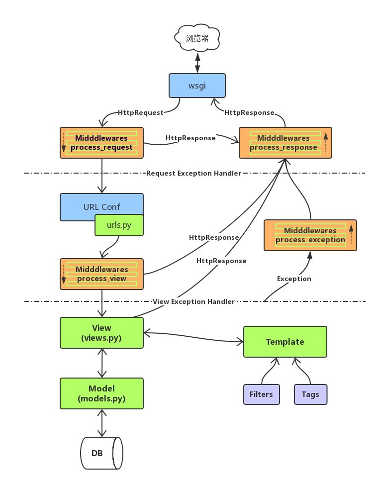

# 《Django 教程》
 - 讲师: 魏明择
 - 时间: 2019

## 目录

[TOC]

<!-- TOC depthFrom:3 depthTo:5 -->


<!-- /TOC -->

# 中间件 Middleware
- 中间件是 Django 请求/响应处理的钩子框架。它是一个轻量级的、低级的“插件”系统，用于全局改变 Django 的输入(请求)或输出(响应)。

- 每个中间件组件负责做一些特定的功能。例如，Django 包含一个中间件组件 AuthenticationMiddleware，它使用会话将用户与请求关联起来。

- 他的文档解释了中间件是如何工作的，如何激活中间件，以及如何编写自己的中间件。Django 具有一些内置的中间件，你可以直接使用。它们被记录在 **built-in middleware reference** 中。

- **中间件类:**
  
    #### 中间件类须继承自 < django.utils.deprecation.MiddlewareMixin >类
    
    #### 中间件类须实现下列五个方法中的一个或多个:
    
    一 . `def process_request(self, request):`
    
    ​		**执行视图之前被调用**，在每个请求上调用，返回None或HttpResponse对象 
    
    二 . `def process_view(self, request, callback, callback_args, callback_kwargs):` 

    ​		 **调用视图之前被调用**，在每个请求上调用，返回None或HttpResponse对象
    
    三 . `def process_response(self, request, response):` 
    
    ​		 **所有响应返回浏览器之前被调用**，在每个请求上调用，返回HttpResponse对象
    
    四 . `def process_exception(self, request, exception):`
    
    ​		 **当处理过程中抛出异常时调用**，返回一个HttpResponse对象
    
    五 . `def process_template_response(self, request, response):`
    
    ​         **在视图刚好执行完毕之后被调用**，在每个请求上调用，返回实现了render方法的响应对象
    
    **注意**：1 .  中间件中的大多数方法在返回None时表示忽略当前操作进入下一项事件，当返回HttpResponese				 对象时表示此请求结果，直接返回给客户端。
    
    ​			2 . 中间件类中的函数名不可变，需要利用子类函数名覆盖父类函数名，自定义子类功能。
    
    ​			3 . 建议书写中间件时一个类封装一个中间件函数，防止一个类多个中间件不便于维护更改. 
    
- 编写中间件类:
```python
# file : middleware/mymiddleware.py
from django.http import HttpResponse, Http404
from django.utils.deprecation import MiddlewareMixin

class MyMiddleWare(MiddlewareMixin):
    def process_request(self, request):       < ----方法名用于覆盖父类名，不能不一致
        print("中间件方法 process_request 被调用")

    def process_view(self, request, callback, callback_args, callback_kwargs):
        print("中间件方法 process_view 被调用")

    def process_response(self, request, response):
        print("中间件方法 process_response 被调用")
        return response

    def process_exception(self, request, exception):
        print("中间件方法 process_exception 被调用")

    def process_template_response(self, request, response):
        print("中间件方法 process_template_response 被调用")
        return response
```
```python
from django.http import HttpResponse
from django.utils.deprecation import MiddlewareMixin
class MyMiddleware(MiddlewareMixin):
    "自定义一个MyMiddleware类"
    count = 0 # 此变量用不记录整个网站的访问次数
    def process_request(self,request):
        self.__class__.count += 1
        print("count = %d"%self.__class__.count)
        if self.__class__.count <= 5:
            return None
        else:
            html = "你已经访问此网站5次，你在执行视图之前或你在http请求前被拦截了"
            return HttpResponse(html)
```

#### 注册中间件:

```python
# file : settings.py
MIDDLEWARE = [
    ...
    'middleware.mymiddleware.MyMiddleWare',
]
```
- 中间件的执行过程
    - 
<!-- 
- 参考文档:
    - <https://blog.csdn.net/u010525694/article/details/81428213>
 -->

- 练习
    - 用中间件实现强制某个IP地址只能向/test 发送一次GET请求
    - 提示:
        - request.META['REMOTE_ADDR'] **可以得到远程客户端的IP地址**
        - request.path_info **可以得到客户端访问的GET请求路由信息**
    - 答案:
        ```python
        from django.http import HttpResponse, Http404
        from django.utils.deprecation import MiddlewareMixin
        import re
        class VisitLimit(MiddlewareMixin):
            '''此中间件限制一个IP地址对应的访问/user/login 的次数不能改过10次,超过后禁止使用'''
            visit_times = {}  # 此字典用于记录客户端IP地址有访问次数
            def process_request(self, request):
                # 不是POST请求时放过
                if request.method != "POST":
                    retutn
                ip_address = request.META['REMOTE_ADDR']  # 得到IP地址
                if not re.match('^/test', request.path_info): #"^/test"限制次数的路由
                    return
                times = self.visit_times.get(ip_address, 0)
                print("IP:", ip_address, '已经访问过', times, '次!:', request.path_info)
        self.visit_times[ip_address] = times + 1
                if times < 5:
                    return
        
                return HttpResponse('你已经访问过' + str(times) + '次，您被禁止了')
            
        # 注意书写中间件后：需要在setting.py中注册中间件
        MIDDLEWARE = [
            'django.middleware.security.SecurityMiddleware',
            'django.contrib.sessions.middleware.SessionMiddleware',
            'django.middleware.common.CommonMiddleware',
            # 'django.middleware.csrf.CsrfViewMiddleware',
            'django.contrib.auth.middleware.AuthenticationMiddleware',
            'django.contrib.messages.middleware.MessageMiddleware',
            'django.middleware.clickjacking.XFrameOptionsMiddleware',
            #　"middleware.mymw.MyMiddleware" # 注册自定义中间件：包下的模块下的类
             "middleware.mymw. VisitLimit" # 注册自定义中间件：包下的模块下的类
        ]
        
        ```


# 跨站请求伪造保护 CSRF
- 跨站请求伪造攻击
  
    - 某些恶意网站上包含链接、表单按钮或者JavaScript，它们会利用登录过的用户在浏览器中的认证信息试图在你的网站上完成某些操作，这就是跨站请求伪造。 
    
- CSRF 
    ```
    Cross-Site Request Forgey
    跨     站点   请求    伪装
    ```
    
- 说明:
  
    - CSRF中间件和模板标签提供对跨站请求伪造简单易用的防护。 
    
- **作用:**
  
    - **不让其它表单提交到此 Django 服务器**，不让其他表单POST请求提交到Django服务器。
    
- **解决方案**:
  
    **方法一：取消 csrf 验证(不推荐)**
    
    - 删除 settings.py 中 MIDDLEWARE 中的 `django.middleware.csrf.CsrfViewMiddleware` 的中间件
    
    **方法二：开放验证**
    
    ```python
    在视图处理函数增加: @csrf_protect
    @csrf_protect
    def post_views(request):
        pass
    ```
    
    **方法三：通过验证(推荐)**
    
    ```html
    需要在表单中增加一个标签 
    
    
    添加通过服务器的密码验证
    ```
    
    ```html
    验证例子:
    <body>
            <form action="/user/login" method="post">
                <!-- 跨站请求伪造保护 CSRF-->
                <input type='hidden' name='csrfmiddlewaretoken' value='qG22uIqh5roh2OTv8CXO74LKTaFEjbWXuL2T6uKl9Qs5TFU1VoZZyNDKzNRDqIyl' />
             < --- 随机密码串，每次登录每次更改密码　　　　
    
    ```
    
    #### 获取验证
    
    一 . **定 义:**
    
    跨站请求伪造CSRF : 某些恶意网站上包含链接、表单按钮或者JavaScript,它们会利用登录过的用户在浏览器中的认证信息试图在你的网站上完成某些操作，所以会设置中间件防止伪造的链接。
    1 . 通过添加验证。
    
    2 . HTML中会出现**属性name名**为**csrfmiddlewaretoken**的**input**标签。
    
    3 . input标签的value值是通过**防止跨站请求伪造CSRF中间件**的密码。
    
    4 . 可以通过HTTP POST请求体中添加 csrfmiddlewaretoken=<input/>标签 发送验证码给服务器通过验证。
    
    ```javascript
    // 获取csrfmiddlewaretoken的值
    var csrf = $("[name='csrfmiddlewaretoken']").val();
    
    例如：
    <http://127.0.0.1:8000/?csrfmiddlewaretoken=csrf>
    ```
    
    **HTML 中添加：后的HTML**　
    
    ```html
    HTML 中添加：　　
    服务器响应给客户端的HTML源代码中会传递input标签，随机生成value值作为通过中间件的密码,每次密码都不一样.
    <input type='hidden' name='csrfmiddlewaretoken' 						         value='zKUrHwWHAQFIaquYDLohyBys1U0FQZquuW3qY5rtXn9QCeqOcxPLbRH4bMsfreA4' />
    ```
    
    - 练习: 项目的注册部分
        1. 创建一个数据库 - FruitDay
        2. 创建实体类 - Users
            1. uphone - varchar(11)
            2. upwd - varchar(50)
            3. uemail - varchar(245)
            4. uname - varchar(20)
            5. isActive - tinyint 默认值为1 (True)
        3. 完善注册 - /register/
            1. 如果是get请求,则去往register.html
            2. 如果是post请求,则处理请求数据
                将提交的数据保存回数据库

# Django中的forms模块
**作　用　：**

​				一　. 生成表单,创建表单内部的表单控件。

​				二　.主要功能是利用forms模块**实现表单验证**。 		

- 在Django中提供了 forms 模块,用forms 模块可以自动生成form内部的表单控件,同时在服务器端可以用对象的形式接收并操作客户端表单元素，并能对表单的数据进行服务器端验证
1. forms模块的作用
   
    - 通过 forms 模块,允许将表单与class相结合，允许通过 class 生成表单
2. #### 使用 forms 模块的步骤
   
    1. 在应用中创建 forms.py 
    2. 导入 django 提供的 forms
       
        - from django import forms
    3. 创建class,一个class会生成一个表单
        - 定义表单类
            ```python
                class ClassName(forms.Form):
                    ...
            ```
4. 在 class 中创建类属性
   - 一个类属性对应到表单中是一个控件
   
    5. 利用Form 类型的对象自动成表单内容
    6. 读取form表单并进行验证数据
   
3. #### forms.Form 的语法
   
    - 属性 = forms.Field类型(参数)
    1. 类型 
        ```python
        class XXX(froms.Form):
            forms.CharField() : 文本框 <input type="text">
            forms.ChoiceField() : 下拉选项框 <select>
            forms.DateField() : 日期框 <input type="date">
            ... ...
        ```
    2. 参数
        1. label 
            - 控件前的文本
        2. widget
            - 指定小部件
        3. initial
            - 控件的初始值(主要针对文本框类型)
        4. required
            - 是否为必填项，值为(True/False)

- form 表单示例
    - 手动实现Form 表单
        ```html
        <form action="/test_form1" method="post">
            <div>
                <label for="id_input_text">请输入内容:</label> <input type="text" name="input_text" id="id_input_text" />
            </div>
            <button type="submit">提交</button>
        </form>
        ```

    - Django Form 实现 Form 表单
        ```python
        class MySearch(forms.Form):
            input_text = forms.CharField(label = '请输入内容')
        ```

4. 在模板中解析form对象
    1. 方法
        1. 需要自定义 <form>
        2. 表单中的**按钮(提交按钮)**需要自定义
    2. **解析form对**
       
        ```python
        在 视图中创建form对象并发送到模板中解析.
        ex:
            form = XXXForm()
            return render(request,'xx.html',locals())
        ```
        1. 手动解析
            
                field : 表示的是form对象中的每个属性(控件)
                {{field.label}} : 表示的是label参数值
                {{field}} : 表示的就是控件
    
        
    2. 自动解析
        1. {{form.as_p}}    
            `将 form 中的每个属性(控件/文本)都使用p标记包裹起来再显示`
        2. {{form.as_ul}}
            ```
            将 form 中的每个属性(控件/文本)都使用li标记包裹起来再显示
            注意:必须手动提供ol 或 ul 标记
            ```
        3. {{form.as_table}}
            ```
            将 form 中的每个属性(控件/文本)都使用tr标记包裹起来再显示
            注意:必须手动提供table标记
            ```
    
    - 练习:
        1. 创建一个注册Form类 - RegisterForm
            - username - 用户名称
            - password - 用户密码(文本框)
            - password2 - 重复用户密码(文本框)
            - phonenumber - 用户年龄(数字框)
            - email - 电子邮箱
        2.创建 register 路由
            - get 请求 :
                - 创建 RegisterForm 对象并发送到 模板register.html中显示
            - post 请求:
            - 接收13-register.html 中的数据并输出
    
    #### 通过 forms 对象获取表单数据
    
    1. 通过 forms.Form 子类的构造器来接收 post 数据
        - form = XXXForm(request.POST)
    2. 必须是 form 通过验证后,才能取值
        - form.is_valid()
            - 返回True:通过验证,可以取值
            - 返回False:暂未通过验证,则不能取值
    3. 通过 form.cleaned_data 字典的属性接收数据
        - form.cleaned_data : dict 类型
7. Field 内置小部件 - widget
    1. 什么是小部件
        - 表示的是生成到网页上的控件以及一些其他的html属性
        ```python
        message=forms.CharField(widget=forms.Textarea)
        upwd=forms.CharField(widget=forms.PasswordInput)
        ```
    2. 常用的小部件类型
        | widget名称 | 对应和type类值 |
        |-|-|
        | TextInput | type='text' |
        | PasswordInput | type='password' |
        | NumberInput | type="number" |
        | EmailInput | type="email" |
        | URLInput | type="url" |
        | HiddenInput | type="hidden" |
        | CheckboxInput | type="checkbox" |
        | CheckboxSelectMultiple | type="checkbox" |
        | RadioSelect  | type="radio" |
        | Textarea  | textarea标记 |
        | Select | select标记 |
        | SelectMultiple | select multiple 标记 |

3. 小部件的使用
    1. 继承自forms.Form
        1. 基本版
            1. 语法
                ```python
                属性 = forms.CharField() #无预选值使用
                    text,password,email,url,textarea,checkbox
                属性 = forms.ChoiceField() #有预选值使用
                    checkbox,radio,select

                属性 = forms.CharField(
                    label='xxx',
                    widget=forms.小部件类型
                )
                ```
            2. 示例:
                ```
                upwd = forms.CharField(
                    label='用户密码',
                    widget=forms.PasswordInput
                )

                message = forms.CharField(
                    label='评论内容',
                    widget=forms.Textarea
                )
                ```
- 文档参见<https://docs.djangoproject.com/en/1.11/topics/forms/>


# Django之form表单验证
**功能作用：django form 提供表单和字段验证**

- 当在创建有不同的多个表单需要提交的网站时，用表单验证比较方便验证的封装
- 当调用**form.is_valid()** 返回True表示当前表单合法，当返回False说明表单验证出现问题
- **验证步骤:**
    1. 先对form.XXXField() 参数值进行验证，比如:min_length,max_length, validators=[...],如果不符合form.is_valid()返回False
    2. 对各自from.clean_zzz属性名(self): 方法对相应属性进行验证,如果验证失败form.is_valid()返回False
    3. 调胳form.clean(self): 对表单的整体结构进行验证，如果验证失败form.is_valid()返回False
    4. 以上验证都成功 form.is_valid()返回True
- 验证方法: 
    - validators = [验证函数1, 验证函数1]
        - 验证函数验证失败抛出forms.ValidationError
        - 验证成功返回None
    - def clean_xxx属性(self):　　　
        - 验证失败必须抛出forms.ValidationError
        - 验证成功必须返回xxx属性的值
    -  def clean(self):        总体验证所有内容是否合法。
        - 验证失败必须抛出forms.ValidationError
        - 验证成功必须返回 self.cleaned_data
- 文档参见<https://docs.djangoproject.com/en/1.11/ref/forms/validation/>
- 验证示例
```python
from django import forms
import re

mobile_re = re.compile(r'^(13[0-9]|15[012356789]|17[678]|18[0-9]|14[57])[0-9]{8}$')
def mobile_validate(value):
    if not mobile_re.match(value):
        raise forms.ValidationError('手机号码格式错误')

class RegisterForm(forms.Form):
    username = forms.CharField(label='用户名')
    password = forms.CharField(label='请输入密码', widget=forms.PasswordInput)
    password2 = forms.CharField(label='再次输入新密码', widget=forms.PasswordInput)
    mobile = forms.CharField(label='电话号码', validators=[mobile_validate])

    def clean(self):
        pwd1 = self.cleaned_data['password']
        pwd2 = self.cleaned_data['password2']
        if pwd1 != pwd2:
            raise forms.ValidationError('两次密码不一致!')
        return self.cleaned_data  # 必须返回cleaned_data

    def clean_username(self):
        username = self.cleaned_data['username']
        if len(username) < 6:
            raise forms.ValidationError("用户名太短")
        return username
```

- 练习，写一个RegisterForm表单类型,要求如下四个属性:
    - username - 用户名称
        - 用户名只能包含[a-zA-Z_0_9]范围内的5~30个英文字符
    - password - 用户密码(文本框)
        - 任意字符，不能少于6个字符
    - password2 - 重复用户密码(文本框)
        - 任意字符，不能少于6个字符且必须与 password一致
    - phonenumber - 用户年龄(数字框)
        - 必须符合`r'^(13[0-9]|15[012356789]|17[678]|18[0-9]|14[57])[0-9]{8}$'`正则表达式


### 分页
- 分页是指在web页面有大量数据需要显示时，当一页的内容太多不利于阅读和不利于数据提取的情况下，可以分为多页进行显示。
- Django提供了一些类来帮助你管理分页的数据 — 也就是说，数据被分在不同页面中，并带有“上一页/下一页”链接。 
- 这些类位于django/core/paginator.py中。

#### Paginator对象
- 对象的构造方法
    - Paginator(object_list, per_page)
    - 参数
        - object_list 对象列表
        - per_page 每页数据个数
    - 返回值:
        - 分页对象

- Paginator属性
    - count：对象总数
    - num_pages：页面总数
    - page_range：从1开始的range对象, 用于记录当前面码数
    - per_page 每页个数

- Paginator方法
    - Paginator.page(number)
        - 参数 number为页码信息(从1开始)
        - 返回当前number页对应的页信息
        - 如果提供的页码不存在，抛出InvalidPage异常

- Paginator异常exception
    - InvalidPage：当向page()传入一个无效的页码时抛出
    - PageNotAnInteger：当向page()传入一个不是整数的值时抛出
    - EmptyPage：当向page()提供一个有效值，但是那个页面上没有任何对象时抛出

#### Page对象
- 创建对象
Paginator对象的page()方法返回Page对象，不需要手动构造
- Page对象属性
    - object_list：当前页上所有对象的列表
    - number：当前页的序号，从1开始
    - paginator：当前page对象相关的Paginator对象
- Page对象方法
    - has_next()：如果有下一页返回True
    - has_previous()：如果有上一页返回True
    - has_other_pages()：如果有上一页或下一页返回True
    - next_page_number()：返回下一页的页码，如果下一页不存在，抛出InvalidPage异常
    - previous_page_number()：返回上一页的页码，如果上一页不存在，抛出InvalidPage异常
    - len()：返回当前页面对象的个数
- 说明:
    - Page 对象是可迭代对象,可以用 for 语句来 访问当前页面中的每个对象

- 参考文档<https://docs.djangoproject.com/en/1.11/topics/pagination/>


- 分页示例:
    - 视图函数
    ```py
    def book(request):
        bks = models.Book.objects.all()
        paginator = Paginator(bks, 10)
        print('当前对象的总个数是:', paginator.count)
        print('当前对象的面码范围是:', paginator.page_range)
        print('总页数是：', paginator.num_pages)
        print('每页最大个数:', paginator.per_page)

        cur_page = request.GET.get('page', 1)  # 得到默认的当前页
        page = paginator.page(cur_page)
        return render(request, 'bookstore/book.html', locals())
    ```
    - 模板设计
    ```html
    <html>
    <head>
        <title>分页显示</title>
    </head>
    <body>
    
        <div>{{ b.title }}</div>
    

    {# 分页功能 #}
    {# 上一页功能 #}
    
    <a href="?page={{ page.previous_page_number }}">上一页</a>
    
    上一页
    

    
        
            {{ p }}
        
            <a href="?page={{ p }}">{{ p }}</a>
        
    

    {#下一页功能#}
    
    <a href="?page={{ page.next_page_number }}">上一页</a>
    
    上一页
    
    总页数: {{ page.len }}
    </body>
    </html>
    ```


