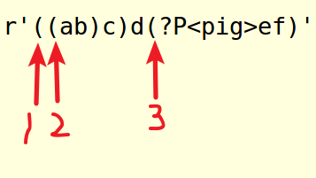
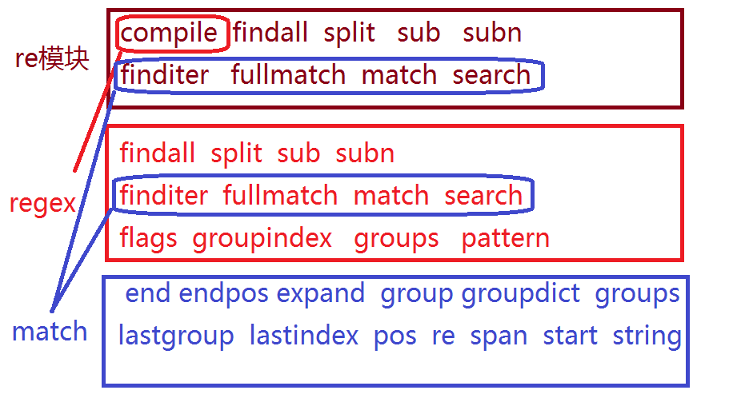

正则表达式
==========================

| Tedu Python 教学部 |
| --- |
| Author：吕泽|
| Days：1天|

[TOC]

## 动机

1. 文本处理已经成为计算机常见工作之一

2. 对文本内容的搜索，定位，提取是逻辑比较复杂的工作

3. 为了快速方便的解决上述问题，产生了正则表达式技术

## 简介

1. 定义

> 即文本的高级匹配模式，提供搜索，替换等功能。其本质是由一系列字符和特殊符号构成的字串，这个字串即正则表达式。

2. 原理

> 通过普通字符和有特定含义的字符，来组成字符串，用以描述一定的字符串规则，比如：重复，位置等，来表达某类特定的字符串，进而匹配。

3. 目标

* 熟练掌握正则表达式元字符

* 能够读懂常用正则表达式，编辑简单的正则规则

* 能够熟练使用re模块操作正则表达式

## 元字符使用

#### 普通字符

* 匹配规则：每个普通字符匹配其对应的字符

```
e.g.
In : re.findall('ab',"abcdefabcd")
Out: ['ab', 'ab']
```

* 注意事项：正则表达式在python中也可以匹配中文

#### 或关系

* 元字符: | 

* 匹配规则: 匹配 | 两侧任意的正则表达式即可

```
e.g.
In : re.findall('com|cn',"www.baidu.com/www.tmooc.cn")
Out: ['com', 'cn']

```

#### 匹配单个字符

* 元字符： . 

* 匹配规则：匹配除换行\n外的任意一个字符

```
e.g.
In : re.findall('张.丰',"张三丰,张四丰,张五丰")
Out: ['张三丰', '张四丰', '张五丰']

```

#### 匹配字符集

* 元字符： [字符集]

* 匹配规则: 匹配字符集中的任意一个字符

* 表达形式: 

>> [abc#!好] 表示 [] 中的任意一个字符
>> [0-9],[a-z],[A-Z] 表示区间内的任意一个字符
>> [_#?0-9a-z]  混合书写，一般区间表达写在后面

```
e.g.
In : re.findall('[aeiou]',"How are you!")
Out: ['o', 'a', 'e', 'o', 'u']
```

#### 匹配字符集反集

* 元字符：[^字符集]

* 匹配规则：匹配除了字符集以外的任意一个字符

```
e.g.
In : re.findall('[^0-9]',"Use 007 port")
Out: ['U', 's', 'e', ' ', ' ', 'p', 'o', 'r', 't']
```

#### 匹配字符串开始位置

* 元字符: ^

* 匹配规则：匹配目标字符串的开头位置

```
e.g.
In : re.findall('^Jame',"Jame,hello")
Out: ['Jame']
```

#### 匹配字符串的结束位置

* 元字符:  $

* 匹配规则: 匹配目标字符串的结尾位置

```
e.g.
In : re.findall('Jame$',"Hi,Jame")
Out: ['Jame']
```

* 规则技巧: ^ 和 $必然出现在正则表达式的开头和结尾处。如果两者同时出现，则中间的部分必须匹配整个目标字符串的全部内容。


#### 匹配字符重复

* 元字符: *

* 匹配规则：匹配前面的字符出现0次或多次

```
e.g.
In : re.findall('wo*',"wooooo~~w!")
Out: ['wooooo', 'w']
```
--------------------

* 元字符：+

* 匹配规则： 匹配前面的字符出现1次或多次

```
e.g.
In : re.findall('[A-Z][a-z]+',"Hello World")
Out: ['Hello', 'World']
```
--------------------
* 元字符：?

* 匹配规则： 匹配前面的字符出现0次或1次

```
e.g. 匹配整数
In [28]: re.findall('-?[0-9]+',"Jame,age:18, -26")
Out[28]: ['18', '-26']
```

-----------------------
* 元字符：{n}

* 匹配规则： 匹配前面的字符出现n次

```
e.g. 匹配手机号码
In : re.findall('1[0-9]{10}',"Jame:13886495728")
Out: ['13886495728']

```
-----------------------
* 元字符：{m,n}

* 匹配规则： 匹配前面的字符出现m-n次

```
e.g. 匹配qq号
In : re.findall('[1-9][0-9]{5,10}',"Baron:1259296994") 
Out: ['1259296994']
```

#### 匹配任意（非）数字字符

* 元字符： \d   \D

* 匹配规则：\d 匹配任意数字字符，\D 匹配任意非数字字符

```
e.g. 匹配端口
In : re.findall('\d{1,5}',"Mysql: 3306, http:80")
Out: ['3306', '80']
```

#### 匹配任意（非）普通字符

* 元字符： \w   \W

* 匹配规则: \w 匹配普通字符，\W 匹配非普通字符

* 说明: 普通字符指数字，字母，下划线，汉字。

```
e.g.
In : re.findall('\w+',"server_port = 8888")
Out: ['server_port', '8888']
```

#### 匹配任意（非）空字符

* 元字符： \s   \S

* 匹配规则: \s 匹配空字符，\S 匹配非空字符

* 说明：空字符指 空格 \r \n \t \v \f 字符

```
e.g.
In : re.findall('\w+\s+\w+',"hello    world")
Out: ['hello    world']
```

#### 匹配开头结尾位置

* 元字符： \A   \Z

* 匹配规则： \A 表示开头位置，\Z 表示结尾位置

#### 匹配（非）单词的边界位置

* 元字符： \b   \B

* 匹配规则： \b 表示单词边界，\B 表示非单词边界

* 说明：单词边界指数字字母(汉字)下划线与其他字符的交界位置。

```
e.g.
In : re.findall(r'\bis\b',"This is a test.")
Out: ['is']
```

| 类别     | 元字符                         |
| ------     | --------------                   |
| 匹配字符  | . [...] [^...] \d \D \w \W \s \S |
| 匹配重复 | * +  ?  {n}  {m,n}               |
| 匹配位置 | ^  $  \A  \Z  \b   \B            |
| 其他     | `|`   ()    \                      |


## 正则表达式的转义

1. 如果使用正则表达式匹配特殊字符则需要加 \ 表示转义。

>>特殊字符: . * + ? ^ $ [] () {} | \

```
e.g. 匹配特殊字符 . 时使用 \. 表示本身含义
In : re.findall('-?\d+\.?\d*',"123,-123,1.23,-1.23")
Out: ['123', '-123', '1.23', '-1.23']
```

2. 在编程语言中，常使用原生字符串书写正则表达式避免多重转义的麻烦。

```
e.g.
python字符串  -->    正则    -->    目标字符串
"\\$\\d+"   解析为   \$\d+   匹配   "$100"

"\\$\\d+"  等同于  r"\$\d+"
```

## 贪婪模式和非贪婪模式

1. 定义

>贪婪模式: 默认情况下，匹配重复的元字符总是尽可能多的向后匹配内容。比如: *  +  ?  {m,n}

>非贪婪模式(懒惰模式): 让匹配重复的元字符尽可能少的向后匹配内容。

2. 贪婪模式转换为非贪婪模式

* 在匹配重复元字符后加 '?' 号即可
```
*  :  *?
+  :  +?
?  :  ??
{m,n} : {m,n}?
```
```
e.g.
In : re.findall(r'\(.+?\)',"(abcd)efgh(higk)")
Out: ['(abcd)', '(higk)']
```

## 正则表达式分组

1. 定义

> 在正则表达式中，以()建立正则表达式的内部分组，子组是正则表达式的一部分，可以作为内部整体操作对象。

2. 作用

* 可以被作为整体操作，改变元字符的操作对象

```python
e.g.  改变 +号 重复的对象
In : re.search(r'(ab)+',"ababababab").group()
Out: 'ababababab'

e.g. 改变 |号 操作对象
In : re.search(r'(王|李)\w{1,3}',"王者荣耀").group()
Out: '王者荣耀'
```

* 可以通过编程语言某些接口获取匹配内容中，子组对应的内容部分

```
e.g. 获取url协议类型
re.search(r'(https|http|ftp|file)://\S+',"https://www.baidu.com").group(1)

```

3. 捕获组

可以给正则表达式的子组起一个名字，表达该子组的意义。这种有名称的子组即为捕获组。

>格式：`(?P<name>pattern)`

```
e.g. 给子组命名为 "pig"
In : re.search(r'(?P<pig>ab)+',"ababababab").group('pig')
Out: 'ab'

```

4. 注意事项

* 一个正则表达式中可以包含多个子组
* 子组可以嵌套，但是不要重叠或者嵌套结构复杂
* 子组序列号一般从外到内，从左到右计数



## 正则表达式匹配原则

1. 正确性,能够正确的匹配出目标字符串.
2. 排他性,除了目标字符串之外尽可能少的匹配其他内容.
3. 全面性,尽可能考虑到目标字符串的所有情况,不遗漏.

# Python三种使用方式

```python
'方法一： 	re模块 调用re模块的方法
'方法二:	 compile对象 调用compile对象的方法
'方法三：	match对象 调用match对象的属性和方法
```

# Python re模块使用

***参考代码re/regex.py***

----------------------

```python
 regex = re.compile(pattern,flags = 0)
 功能: 生产正则表达式对象
 参数: pattern  正则表达式
      flags  功能标志位,扩展正则表达式的匹配
 返回值: 正则表达式对象
```
------------------------
```python
 re.findall(pattern,string,flags = 0)
 功能: 根据正则表达式匹配目标字符串内容
 参数: pattern  正则表达式
      string 目标字符串
      flags  功能标志位,扩展正则表达式的匹配        
 返回值: 匹配到的内容列表,如果正则表达式有子组则只能获取到子组对应的内容 
```
------------------------
```python
 regex.findall(string,pos,endpos)
 功能: 根据正则表达式匹配目标字符串内容
 参数: string 目标字符串
      pos 截取目标字符串的开始匹配位置
      endpos 截取目标字符串的结束匹配位置
 返回值: 匹配到的内容列表,如果正则表达式有子组则只能获取到子组对应的内容
```
------------------------
 ```python
 re.split(pattern,string,flags = 0)
 功能: 使用正则表达式匹配内容,切割目标字符串
 参数: pattern  正则表达式
      string 目标字符串
      flags  功能标志位,扩展正则表达式的匹配
 返回值: 切割后的内容列表
 ```
------------------------
```python
 re.sub(pattern,replace,string,max,flags = 0)
 功能: 使用一个字符串替换正则表达式匹配到的内容
 参数: pattern  正则表达式
      replace  替换的字符串
      string 目标字符串
      max  最多替换几处,默认替换全部
      flags  功能标志位,扩展正则表达式的匹配
 返回值: 替换后的字符串
```
------------------------
```python
 re.subn(pattern,replace,string,max,flags = 0)
 功能: 使用一个字符串替换正则表达式匹配到的内容
 参数: pattern  正则表达式
      replace  替换的字符串
      string 目标字符串
      max  最多替换几处,默认替换全部
      flags  功能标志位,扩展正则表达式的匹配
 返回值: 替换后的字符串和替换了几处
```
```python
 re.finditer(pattern,string,flags = 0)
 功能: 根据正则表达式匹配目标字符串内容
 参数: pattern  正则表达式
      string 目标字符串
      flags  功能标志位,扩展正则表达式的匹配
 返回值: 匹配结果的迭代器
```
------------------------
```python
re.fullmatch(pattern,string,flags=0)
功能：完全匹配某个目标字符串
参数：pattern 正则
	string  目标字符串
返回值：匹配内容match object    <------'匹配结果为match对象
```
------------------------
```python
re.match(pattern,string,flags=0)
功能：匹配某个目标字符串开始位置
参数：pattern 正则
	string  目标字符串
返回值：匹配内容match object    <------'匹配结果为match对象
```
------------------------
```python
re.search(pattern,string,flags=0)
功能：匹配目标字符串第一个符合内容
参数：pattern 正则
	string  目标字符串
返回值：匹配内容match object   <------'匹配结果为match对象
```
------------------------

#### **compile对象属性**

	【1】 flags ： flags值
	【2】 pattern ： 正则表达式
	【3】 groups ： 子组数量
	【4】 groupindex ： 捕获组名与组序号的字典

------------------------

# match对象的属性方法

***参考代码re/regex2.py***

**match对象属性变量**

* pos   匹配的目标字符串开始位置                    

* endpos  匹配的目标字符串结束位置

* re     获取正则表达式

* string  获取目标字符串

* lastgroup  获取最后一组的名称

* lastindex  获取最后一组的序号
	
	```python
	 # 使用示例： match对象 . match对象的属性变量
	    match_obj = re.search(正则,目标字符串,flags=0)
	    match_obj.pop 匹配的目标字符串开始位置  
	    match_obj.string  目标字符串
	```

**match对象属性方法**

* span()  获取匹配内容的起止位置

* start() 获取匹配内容的开始位置

* end()   获取匹配内容的结束位置

* groupdict()  获取捕获组字典，组名为键，对应内容为值

* groups() 获取子组对应内容
  
* group(n = 0)

	  功能：获取match对象匹配内容
	  参数：默认为0表示获取整个match对象内容，如果是序列号或者组名则表示获取对应子组内容
	  返回值：匹配字符串



### flags参数扩展

***参考代码re/flags.py***

  1. 使用函数：re模块调用的匹配函数。如：re.compile,re.findall,re.search....

  2. 作用：扩展丰富正则表达式的匹配功能

  3. 常用flag
	
> A == ASCII  元字符只能匹配ascii码

> I == IGNORECASE  匹配忽略字母大小写

> S == DOTALL  使 . 可以匹配换行      <----功能上元字符 .  是匹配不到换行\n的.

> M == MULTILINE  使 ^  $可以匹配每一行的开头结尾位置

> X == VERBOSE  为正则添加注释

  4. 使用多个flag
	
     方法：使用按位或连接  
	  e.g. ：  flags = re.I | re.A


