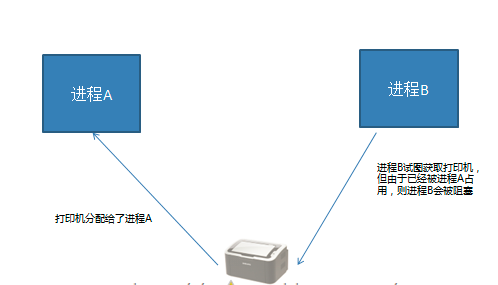

并发编程
==========================

| Tedu Python 教学部 |
| --- |
| Author：吕泽|
| Days：6天|

-----------

[TOC]

## 多任务编程

1. 意义： 充分利用计算机多核资源，提高程序的运行效率。

2. 实现方案 ：多进程 ， 多线程

3. 并行与并发
>并发 ： 同时处理多个任务，内核在任务间不断的切换达到好像多个任务被同时执行的效果，实际每个时刻只有一个任务占有内核。

>并行 ： 多个任务利用计算机多核资源在同时执行，此时多个任务间为并行关系。


## 进程（process）

### 进程理论基础

1. 定义 ： 程序在计算机中的一次运行。
>* 程序是一个可执行的文件，是静态的占有磁盘。
>* 进程是一个动态的过程描述，占有计算机运行资源，有一定的生命周期。


2. 系统中如何产生一个进程
		  【1】 用户空间通过调用程序接口或者命令发起请求
			【2】 操作系统接收用户请求，开始创建进程
			【3】 操作系统调配计算机资源，确定进程状态等
			【4】 操作系统将创建的进程提供给用户使用


		
3. 进程基本概念

* cpu时间片：如果一个进程占有cpu内核则称这个进程在cpu时间片上。

* PCB(进程控制块)：在内存中开辟的一块空间，用于存放进程的基本信息，也用于系统查找识别进程。
	
* 进程ID（PID）： 系统为每个进程分配的一个大于0的整数，作为进程ID。每个进程ID不重复。
	
	>Linux查看进程ID ： ps -aux
	
* 父子进程 ： 系统中每一个进程(除了系统初始化进程)都有唯一的父进程，可以有0个或多个子进程。父子进程关系便于进程管理。
	
>查看进程树： pstree
	
* 进程状态

	- 三态  
		就绪态 ： 进程具备执行条件，等待分配cpu资源
		运行态 ： 进程占有cpu时间片正在运行
		等待态 ： 进程暂时停止运行，让出cpu


  - 五态 (在三态基础上增加新建和终止)
		新建 ： 创建一个进程，获取资源的过程
		终止 ： 进程结束，释放资源的过程


  - 状态查看命令 ： ps -aux  --> STAT列

>				S 等待态
>				R 执行态
>				D 等待态
>				T 等待态
>				Z 僵尸

>				<  有较高优先级
>				N  优先级较低
>				+  前台进程
>				s  会话组组长
>				l  有多线程的

* 进程的运行特征
	【1】 进程可以使用计算机多核资源
	【2】 进程是计算机分配资源的最小单位
	【3】 进程之间的运行互不影响，各自独立
	【4】 每个进程拥有独立的空间，各自使用自己空间资源

>面试要求
>>1. 什么是进程，进程和程序有什么区别
>>2. 进程有哪些状态，状态之间如何转化


## 基于fork的多进程编程

### fork使用

***代码示例：day1/fork.py***
***代码示例：day1/fork1.py***

> pid = os.fork()
		功能： 创建新的进程
		返回值：整数，如果创建进程失败返回一个负数，如果成功则在原有进程中返回新进程的PID，在新进程中返回0

>注意
>>* 子进程会复制父进程全部内存空间，从fork下一句开始执行。
>>* 父子进程各自独立运行，运行顺序不一定。
>>* 利用父子进程fork返回值的区别，配合if结构让父子进程执行不同的内容几乎是固定搭配。
>>* 父子进程有各自特有特征比如PID PCB 命令集等。
>>* 父进程fork之前开辟的空间子进程同样拥有，父子进程对各自空间的操作不会相互影响。

### 进程相关函数

***代码示例：day1/get_pid.py***
***代码示例：day1/exit.py***

>os.getpid()
			功能： 获取一个进程的PID值
			返回值： 返回当前进程的PID 

>os.getppid()
			功能： 获取父进程的PID号
			返回值： 返回父进程PID

>os._exit(status)
			功能: 结束一个进程
			参数：进程的终止状态

>sys.exit([status])
			功能：退出进程
			参数：整数 表示退出状态
						字符串 表示退出时打印内容

### 孤儿和僵尸

1. 孤儿进程 ： 父进程先于子进程退出，此时子进程成为孤儿进程。

>特点： 孤儿进程会被系统进程收养，此时系统进程就会成为孤儿进程新的父进程，孤儿进程退出该进程会自动处理。

2. 僵尸进程 ： 子进程先于父进程退出，父进程又没有处理子进程的退出状态，此时子进程就会称为僵尸进程。

>特点： 僵尸进程虽然结束，但是会存留部分PCB在内存中，大量的僵尸进程会浪费系统的内存资源。

3. 如何避免僵尸进程产生


  * 使用wait函数处理子进程退出

  ***代码示例：day1/wait.py***

		```		
		pid,status = os.wait()
		功能：在父进程中阻塞等待处理子进程退出
		返回值： pid  退出的子进程的PID
			status  子进程退出状态
		
		```


   * 创建二级子进程处理僵尸

		***代码示例：day1/child.py***

	【1】 父进程创建子进程，等待回收子进程
	【2】 子进程创建二级子进程然后退出
	【3】 二级子进程称为孤儿，和原来父进程一同执行事件


  * 通过信号处理子进程退出
				
	>原理： 子进程退出时会发送信号给父进程，如果父进程忽略子进程信号，则系统就会自动处理子进程退出。

	>方法： 使用signal模块在父进程创建子进程前写如下语句 ：
	```python
	import signal
	signal.signal(signal.SIGCHLD,signal.SIG_IGN)
	```

	>特点 ： 非阻塞，不会影响父进程运行。可以处理所有子进程退出


### 群聊聊天室 

>功能 ： 类似qq群功能
	【1】 有人进入聊天室需要输入姓名，姓名不能重复
	【2】 有人进入聊天室时，其他人会收到通知：xxx 进入了聊天室
	【3】 一个人发消息，其他人会收到：xxx ： xxxxxxxxxxx
	【4】 有人退出聊天室，则其他人也会收到通知:xxx退出了聊天室
	【5】 扩展功能：服务器可以向所有用户发送公告:管理员消息： xxxxxxxxx


##  multiprocessing 模块创建进程

### 进程创建方法

***代码示例：day2/process1.py***
***代码示例：day2/process2.py***
***代码示例：day2/process3.py***

1.  流程特点 
【1】 将需要子进程执行的事件封装为函数
【2】 通过模块的Process类创建进程对象，关联函数
【3】 可以通过进程对象设置进程信息及属性
【4】 通过进程对象调用start启动进程
【5】 通过进程对象调用join回收进程
	
2. 基本接口使用

```python
Process()
功能 ： 创建进程对象
参数 ： target 绑定要执行的目标函数 
	args 元组，用于给target函数位置传参
	kwargs 字典，给target函数键值传参
```

```python
p.start()
功能 ： 启动进程
```
>注意:启动进程此时target绑定函数开始执行，该函数作为子进程执行内容，此时进程真正被创建

```python
p.join([timeout])
功能：阻塞等待回收进程
参数：超时时间
```
>注意
>>* 使用multiprocessing创建进程同样是子进程复制父进程空间代码段，父子进程运行互不影响。
>>* 子进程只运行target绑定的函数部分，其余内容均是父进程执行内容。
>>* multiprocessing中父进程往往只用来创建子进程回收子进程，具体事件由子进程完成。
>>* multiprocessing创建的子进程中无法使用标准输入

3. 进程对象属性

***代码示例：day2/process_attr.py***

>p.name  进程名称

>p.pid   对应子进程的PID号

>p.is_alive() 查看子进程是否在生命周期

>p.daemon  设置父子进程的退出关系  
>>* 如果设置为True则子进程会随父进程的退出而结束
>>* 要求必须在start()前设置
>>* 如果daemon设置成True 通常就不会使用 join()


###  进程池实现

***代码示例：day2/pool.py***

1.  必要性
	  【1】 进程的创建和销毁过程消耗的资源较多
		【2】 当任务量众多，每个任务在很短时间内完成时，需要频繁的创建和销毁进程。此时对计算机压力较大
		【3】 进程池技术很好的解决了以上问题。
	
2.  原理
>创建一定数量的进程来处理事件，事件处理完进	程不退出而是继续处理其他事件，直到所有事件全都处理完毕统一销毁。增加进程的重复利用，降低资源消耗。


3. 进程池实现

【1】 创建进程池对象，放入适当的进程

```python	  
from multiprocessing import Pool

Pool(processes)
功能： 创建进程池对象
参数： 指定进程数量，默认根据系统自动判定
```

【2】 将事件加入进程池队列执行

```python
pool.apply_async(func,args,kwds)
功能: 使用进程池执行 func事件
参数： func 事件函数
      args 元组  给func按位置传参
      kwds 字典  给func按照键值传参
返回值： 返回函数事件对象
```

【3】 关闭进程池

```python
pool.close()
功能： 关闭进程池
```

【4】 回收进程池中进程

```
pool.join()
功能： 回收进程池中进程
```


##  进程间通信（IPC）

1. 必要性： 进程间空间独立，资源不共享，此时在需要进程间数据传输时就需要特定的手段进行数据通信。


2. 常用进程间通信方法
>管道  消息队列  共享内存  信号  信号量  套接字 


###  管道通信(Pipe)

***代码示例：day2/pipe.py***

1. 通信原理
>在内存中开辟管道空间，生成管道操作对象，多个进程使用同一个管道对象进行读写即可实现通信

2. 实现方法

```python
from  multiprocessing import Pipe

fd1,fd2 = Pipe(duplex = True)
功能: 创建管道
参数：默认表示双向管道
如果为False 表示单向管道
返回值：表示管道两端的读写对象
	如果是双向管道均可读写
	如果是单向管道fd1只读  fd2只写

fd.recv()
功能 ： 从管道获取内容
返回值：获取到的数据

fd.send(data)
功能： 向管道写入内容
参数： 要写入的数据
```

### 消息队列

***代码示例：day2/queue_0.py***

1.通信原理
>在内存中建立队列模型，进程通过队列将消息存入，或者从队列取出完成进程间通信。

2. 实现方法

```python
from multiprocessing import Queue

q = Queue(maxsize=0)
功能: 创建队列对象
参数：最多存放消息个数
返回值：队列对象

q.put(data,[block,timeout])
功能：向队列存入消息
参数：data  要存入的内容
block  设置是否阻塞 False为非阻塞
timeout  超时检测

q.get([block,timeout])
功能：从队列取出消息
参数：block  设置是否阻塞 False为非阻塞
timeout  超时检测
返回值： 返回获取到的内容

q.full()   判断队列是否为满
q.empty()  判断队列是否为空
q.qsize()  获取队列中消息个数
q.close()  关闭队列
```

### 共享内存

***代码示例：day3/value.py***
***代码示例：day3/array.py***

1. 通信原理：在内中开辟一块空间，进程可以写入内容和读取内容完成通信，但是每次写入内容会覆盖之前内容。

2. 实现方法


```python
from multiprocessing import Value,Array

obj = Value(ctype,data)
功能 ： 开辟共享内存
参数 ： ctype  表示共享内存空间类型 'i'  'f'  'c'
       data   共享内存空间初始数据
返回值：共享内存对象

obj.value  对该属性的修改查看即对共享内存读写


obj = Array(ctype,data)
功能： 开辟共享内存空间
参数： ctype  表示共享内存数据类型
      data   整数则表示开辟空间的大小，其他数据类型表示开辟空间存放的初始化数据
返回值：共享内存对象

Array共享内存读写： 通过遍历obj可以得到每个值，直接可以通过索引序号修改任意值。

* 可以使用obj.value直接打印共享内存中的字节串
```

### 信号量（信号灯集）

***代码示例：day2/sem.py***

1. 通信原理
>给定一个数量对多个进程可见。多个进程都可以操作该数量增减，并根据数量值决定自己的行为。

2. 实现方法

```python	  
from multiprocessing import Semaphore

sem = Semaphore(num)
功能 ： 创建信号量对象
参数 ： 信号量的初始值
返回值 ： 信号量对象

sem.acquire()  将信号量减1 当信号量为0时阻塞
sem.release()  将信号量加1
sem.get_value() 获取信号量数量
```

## 线程编程（Thread）

### 线程基本概念

1. 什么是线程
【1】 线程被称为轻量级的进程
【2】 线程也可以使用计算机多核资源，是多任务编程方式
【3】 线程是系统分配内核的最小单元
【4】 线程可以理解为进程的分支任务
	
2. 线程特征
【1】 一个进程中可以包含多个线程
【2】 线程也是一个运行行为，消耗计算机资源
【3】 一个进程中的所有线程共享这个进程的资源
【4】 多个线程之间的运行互不影响各自运行
【5】 线程的创建和销毁消耗资源远小于进程
【6】 各个线程也有自己的ID等特征

### threading模块创建线程

***代码示例：day3/thread1.py***
***代码示例：day3/thread2.py***

【1】 创建线程对象

```	  
from threading import Thread 

t = Thread()
功能：创建线程对象
参数：target 绑定线程函数
     args   元组 给线程函数位置传参
     kwargs 字典 给线程函数键值传参
```

【2】 启动线程

```
 t.start()
```

【3】 回收线程

```
 t.join([timeout])
```

### 线程对象属性

***代码示例：day3/thread_attr.py***

>t.name 线程名称
>t.setName()  设置线程名称
>t.getName()  获取线程名称

>t.is_alive()  查看线程是否在生命周期

>t.daemon  设置主线程和分支线程的退出关系
>t.setDaemon()  设置daemon属性值
>t.isDaemon()  查看daemon属性值
>
>>daemon为True时主线程退出分支线程也退出。要在start前设置，通常不和join一起使用。


### 自定义线程类

***代码示例：day3/myThread.py***

1. 创建步骤
【1】 继承Thread类
【2】 重写__init__方法添加自己的属性，使用super加载父类属性
【3】 重写run方法

2. 使用方法
【1】 实例化对象
【2】 调用start自动执行run方法
【3】 调用join回收线程


## 同步互斥

### 线程间通信方法

1. 通信方法
>线程间使用全局变量进行通信


2. 共享资源争夺

* 共享资源：多个进程或者线程都可以操作的资源称为共享资源。对共享资源的操作代码段称为临界区。

* 影响 ： 对共享资源的无序操作可能会带来数据的混乱，或者操作错误。此时往往需要同步互斥机制协调操作顺序。
	
3. 同步互斥机制

>同步 ： 同步是一种协作关系，为完成操作，多进程或者线程间形成一种协调，按照必要的步骤有序执行操作。


>互斥 ： 互斥是一种制约关系，当一个进程或者线程占有资源时会进行加锁处理，此时其他进程线程就无法操作该资源，直到解锁后才能操作。




### 线程同步互斥方法

#### 线程Event

***代码示例：day3/thread_event.py***

```python		  
from threading import Event

e = Event()  创建线程event对象

e.wait([timeout])  阻塞等待e被set

e.set()  设置e，使wait结束阻塞

e.clear() 使e回到未被设置状态

e.is_set()  查看当前e是否被设置
```

#### 线程锁 Lock

***代码示例：day3/thread_event.py***

```python
from  threading import Lock

lock = Lock()  创建锁对象
lock.acquire() 上锁  如果lock已经上锁再调用会阻塞
lock.release() 解锁

with  lock:  上锁
...
...
	 with代码块结束自动解锁
```

### 死锁及其处理

1. 定义
>死锁是指两个或两个以上的线程在执行过程中，由于竞争资源或者由于彼此通信而造成的一种阻塞的现象，若无外力作用，它们都将无法推进下去。此时称系统处于死锁状态或系统产生了死锁。


2. 死锁产生条件

***代码示例: day3/dead_lock.py***

>死锁发生的必要条件
>>* 互斥条件：指线程对所分配到的资源进行排它性使用，即在一段时间内某资源只由一个进程占用。如果此时还有其它进程请求资源，则请求者只能等待，直至占有资源的进程用毕释放。
>>* 请求和保持条件：指线程已经保持至少一个资源，但又提出了新的资源请求，而该资源已被其它进程占有，此时请求线程阻塞，但又对自己已获得的其它资源保持不放。
>>* 不剥夺条件：指线程已获得的资源，在未使用完之前，不能被剥夺，只能在使用完时由自己释放,通常CPU内存资源是可以被系统强行调配剥夺的。
>>* 环路等待条件：指在发生死锁时，必然存在一个线程——资源的环形链，即进程集合{T0，T1，T2，···，Tn}中的T0正在等待一个T1占用的资源；T1正在等待T2占用的资源，……，Tn正在等待已被T0占用的资源。

>死锁的产生原因
>>简单来说造成死锁的原因可以概括成三句话：
>>* 当前线程拥有其他线程需要的资源
>>* 当前线程等待其他线程已拥有的资源
>>* 都不放弃自己拥有的资源


3. 如何避免死锁

死锁是我们非常不愿意看到的一种现象，我们要尽可能避免死锁的情况发生。通过设置某些限制条件，去破坏产生死锁的四个必要条件中的一个或者几个，来预防发生死锁。预防死锁是一种较易实现的方法。但是由于所施加的限制条件往往太严格，可能会导致系统资源利用率。


## python线程GIL

1. python线程的GIL问题 （全局解释器锁）

>什么是GIL ：由于python解释器设计中加入了解释器锁，导致python解释器同一时刻只能解释执行一个线程，大大降低了线程的执行效率。

>导致后果： 因为遇到阻塞时线程会主动让出解释器，去解释其他线程。所以python多线程在执行多阻塞高延迟IO时可以提升程序效率，其他情况并不能对效率有所提升。

>GIL问题建议
>* 尽量使用进程完成无阻塞的并发行为
>* 不使用c作为解释器 （Java  C#）

2. 结论 ： 在无阻塞状态下，多线程程序和单线程程序执行效率几乎差不多，甚至还不如单线程效率。但是多进程运行相同内容却可以有明显的效率提升。

## 进程线程的区别联系

### 区别联系
1. 两者都是多任务编程方式，都能使用计算机多核资源
2. 进程的创建删除消耗的计算机资源比线程多
3. 进程空间独立，数据互不干扰，有专门通信方法；线程使用全局变量通信
4. 一个进程可以有多个分支线程，两者有包含关系
5. 多个线程共享进程资源，在共享资源操作时往往需要同步互斥处理
6. 进程线程在系统中都有自己的特有属性标志，如ID,代码段，命令集等。

### 使用场景

1. 任务场景：如果是相对独立的任务模块，可能使用多进程，如果是多个分支共同形成一个整体任务可能用多线程

2. 项目结构：多种编程语言实现不同任务模块，可能是多进程，或者前后端分离应该各自为一个进程。

3. 难以程度：通信难度，数据处理的复杂度来判断用进程间通信还是同步互斥方法。


### 要求
1. 对进程线程怎么理解/说说进程线程的差异
2. 进程间通信知道哪些，有什么特点
3. 什么是同步互斥，你什么情况下使用，怎么用
4. 给一个情形，说说用进程还是线程，为什么
5. 问一些概念，僵尸进程的处理，GIL问题，进程状态


## 并发网络通信模型

### 常见模型分类

1. 循环服务器模型 ：循环接收客户端请求，处理请求。同一时刻只能处理一个请求，处理完毕后再处理下一个。

	>优点：实现简单，占用资源少
	>缺点：无法同时处理多个客户端请求

	>适用情况：处理的任务可以很快完成，客户端无需长期占用服务端程序。udp比tcp更适合循环。

2. IO并发模型：利用IO多路复用,异步IO等技术，同时处理多个客户端IO请求。

	>优点 ： 资源消耗少，能同时高效处理多个IO行为
	>缺点 ： 只能处理并发产生的IO事件，无法处理cpu计算

	>适用情况：HTTP请求，网络传输等都是IO行为。
	
3. 多进程/线程网络并发模型：每当一个客户端连接服务器，就创建一个新的进程/线程为该客户端服务，客户端退出时再销毁该进程/线程。

	>优点：能同时满足多个客户端长期占有服务端需求，可以处理各种请求。
	>缺点： 资源消耗较大

	>适用情况：客户端同时连接量较少，需要处理行为较复杂情况。


### 基于fork的多进程网络并发模型

***代码实现: day4/fork_server.py***

#### 实现步骤

1. 创建监听套接字
2. 等待接收客户端请求
3. 客户端连接创建新的进程处理客户端请求
4. 原进程继续等待其他客户端连接
5. 如果客户端退出，则销毁对应的进程

### 基于threading的多线程网络并发

***代码实现: day4/thread_server.py***

#### 实现步骤

1. 创建监听套接字
2. 循环接收客户端连接请求
3. 当有新的客户端连接创建线程处理客户端请求
4. 主线程继续等待其他客户端连接
5. 当客户端退出，则对应分支线程退出


### ftp 文件服务器

***代码实现: day5/ftp***

1. 功能 
	【1】 分为服务端和客户端，要求可以有多个客户端同时操作。
	【2】 客户端可以查看服务器文件库中有什么文件。
	【3】 客户端可以从文件库中下载文件到本地。
	【4】 客户端可以上传一个本地文件到文件库。
	【5】 使用print在客户端打印命令输入提示，引导操作


## IO并发

### IO 分类

>IO分类：阻塞IO ，非阻塞IO，IO多路复用，异步IO等


#### 阻塞IO 

1.定义：在执行IO操作时如果执行条件不满足则阻塞。阻塞IO是IO的默认形态。

2.效率：阻塞IO是效率很低的一种IO。但是由于逻辑简单所以是默认IO行为。

3.阻塞情况：
* 因为某种执行条件没有满足造成的函数阻塞
e.g.  accept   input   recv

* 处理IO的时间较长产生的阻塞状态
e.g. 网络传输，大文件读写
			

####　非阻塞IO

1. 定义 ：通过修改IO属性行为，使原本阻塞的IO变为非阻塞的状态。

* 设置套接字为非阻塞IO

 >sockfd.setblocking(bool)
 功能：设置套接字为非阻塞IO
 参数：默认为True，表示套接字IO阻塞；设置为False则套接字IO变为非阻塞

* 超时检测 ：设置一个最长阻塞时间，超过该时间后则不再阻塞等待。

	>sockfd.settimeout(sec)
	功能：设置套接字的超时时间
	参数：设置的时间

### IO多路复用

1. 定义
>同时监控多个IO事件，当哪个IO事件准备就绪就执行哪个IO事件。以此形成可以同时处理多个IO的行为，避免一个IO阻塞造成其他IO均无法执行，提高了IO执行效率。

2. 具体方案

>select方法 ： windows  linux  unix
>poll方法： linux  unix
>epoll方法： linux


#### select 方法

***代码实现: day5/select_server.py***

```python
rs, ws, xs=select(rlist, wlist, xlist[, timeout])
功能: 监控IO事件，阻塞等待IO发生
参数：rlist  列表  存放关注的等待发生的IO事件
      wlist  列表  存放关注的要主动处理的IO事件
      xlist  列表  存放关注的出现异常要处理的IO
      timeout  超时时间

返回值： rs 列表  rlist中准备就绪的IO
        ws 列表  wlist中准备就绪的IO
	xs 列表  xlist中准备就绪的IO
```

select 实现tcp服务

	【1】 将关注的IO放入对应的监控类别列表
	【2】通过select函数进行监控
	【3】遍历select返回值列表，确定就绪IO事件
	【4】处理发生的IO事件

>注意
>>wlist中如果存在IO事件，则select立即返回给ws
>>处理IO过程中不要出现死循环占有服务端的情况
>>IO多路复用消耗资源较少，效率较高

------------
###@@扩展: 位运算

定义 ： 将整数转换为二进制，按二进制位进行运算

运算符号： 
>		&  按位与
>				|  按位或
>				^  按位异或
>				<< 左移
>
>				>> 右移

```python
e.g.  14 --> 01110
      19 --> 10011

14 & 19 = 00010 = 2  一0则0
14 | 19 = 11111 = 31 一1则1
14 ^ 19 = 11101 = 29 相同为0不同为1
14 << 2 = 111000 = 56 向左移动低位补0
14 >> 2 = 11 = 3  向右移动去掉低位

bin() :将整数转化为二进制表达方式:显示结果为:0b数字
oct() :将整数转化为八进制表达方式:显示结果为:0o数字
int() :将整数转化为十进制表达方式:显示结果为:数字
hex() :将整数转化为十六进制表达方式:显示结果为:0x数字

```
----------------


#### poll方法

***代码实现: day5/poll_server.py***

```python
p = select.poll()
功能 ： 创建poll对象
返回值： poll对象
```


```python	
p.register(fd,event)   
功能: 注册关注的IO事件
参数：fd  要关注的IO
      event  要关注的IO事件类型
  	     常用类型：POLLIN  读IO事件（rlist）
		      POLLOUT 写IO事件 (wlist)
		      POLLERR 异常IO  （xlist）
		      POLLHUP 断开连接 
		  e.g. p.register(sockfd,POLLIN|POLLERR)

p.unregister(fd)
功能：取消对IO的关注
参数：IO对象或者IO对象的fileno
```

```python
events = p.poll()
功能： 阻塞等待监控的IO事件发生
返回值： 返回发生的IO
        events格式  [(fileno,event),()....]
        每个元组为一个就绪IO，元组第一项是该IO的fileno，第二项为该IO就绪的事件类型
```

poll_server 步骤
	   
	【1】 创建套接字
	【2】 将套接字register
	【3】 创建查找字典，并维护
	【4】 循环监控IO发生
	【5】 处理发生的IO


#### epoll方法

***代码实现: day5/epoll_server.py***

1. 使用方法 ： 基本与poll相同

	 * 生成对象改为 epoll()
   * 将所有事件类型改为EPOLL类型
	
2. epoll特点

   * epoll 效率比select poll要高
   * epoll 监控IO数量比select要多
   * epoll 的触发方式比poll要多 （EPOLLET边缘触发）


### 协程技术

#### 基础概念

1. 定义：纤程，微线程。是为非抢占式多任务产生子程序的计算机组件。协程允许不同入口点在不同位置暂停或开始，简单来说，协程就是可以暂停执行的函数。

2. 协程原理 ： 记录一个函数的上下文栈帧，协程调度切换时会将记录的上下文保存，在切换回来时进行调取，恢复原有的执行内容，以便从上一次执行位置继续执行。

3. 协程优缺点
	
>优点
>>1. 协程完成多任务占用计算资源很少
>>2. 由于协程的多任务切换在应用层完成，因此切换开销少
>>3. 协程为单线程程序，无需进行共享资源同步互斥处理

>缺点
>
>> 协程的本质是一个单线程，无法利用计算机多核资源

--------------------------------
####扩展延伸@标准库协程的实现

python3.5以后，使用标准库asyncio和async/await 语法来编写并发代码。asyncio库通过对异步IO行为的支持完成python的协程。虽然官方说asyncio是未来的开发方向，但是由于其生态不够丰富，大量的客户端不支持awaitable需要自己去封装，所以在使用上存在缺陷。更多时候只能使用已有的异步库（asyncio等），功能有限

------------------------------

#### 第三方协程模

1.  greenlet模块

***示例代码: day6/greenlet_0.py***

* 安装 ： sudo  pip3 install greenlet

* 函数 

```python
greenlet.greenlet(func)
功能：创建协程对象
参数：协程函数

g.switch()
功能：选择要执行的协程函数
```

2. gevent模块

***示例代码: day6/gevent_test.py***
***示例代码: day6/gevent_server.py***
				
* 安装：sudo pip3 install gevent

* 函数

```python
gevent.spawn(func,argv)
功能: 生成协程对象
参数：func  协程函数
     argv  给协程函数传参（不定参）
返回值： 协程对象

gevent.joinall(list,[timeout])
功能: 阻塞等待协程执行完毕
参数：list  协程对象列表
     timeout 超时时间

gevent.sleep(sec)
功能: gevent睡眠阻塞
参数：睡眠时间

* gevent协程只有在遇到gevent指定的阻塞行为时才会自动在协程之间进行跳转
如gevent.joinall(),gevent.sleep()带来的阻塞
```

* monkey脚本

>作用：在gevent协程中，协程只有遇到gevent指定类型的阻塞才能跳转到其他协程，因此，我们希望将普通的IO阻塞行为转换为可以触发gevent协程跳转的阻塞，以提高执行效率。

> 转换方法：gevent 提供了一个脚本程序monkey,可以修改底层解释IO阻塞的行为，将很多普通阻塞转换为gevent阻塞。

> 使用方法

>>【1】 导入monkey

			from gevent  import monkey

>>【2】 运行相应的脚本，例如转换socket中所有阻塞

			monkey.patch_socket()

>>【3】 如果将所有可转换的IO阻塞全部转换则运行all

			monkey.patch_all()

>>【4】 注意：脚本运行函数需要在对应模块导入前执行


### HTTPServer v2.0 

***day6/http_server.py***

  1. 主要功能 ：
	  【1】 接收客户端（浏览器）请求
		【2】 解析客户端发送的请求
		【3】 根据请求组织数据内容
		【4】 将数据内容形参http响应格式返回给浏览器
	
	2. 升级点 ：
	    【1】 采用IO并发，可以满足多个客户端同时发起请求情况
		【2】 做基本的请求解析，根据具体请求返回具体内容，同时满足客户端简单的非网页请求情况

    【3】 通过类接口形式进行功能封装


